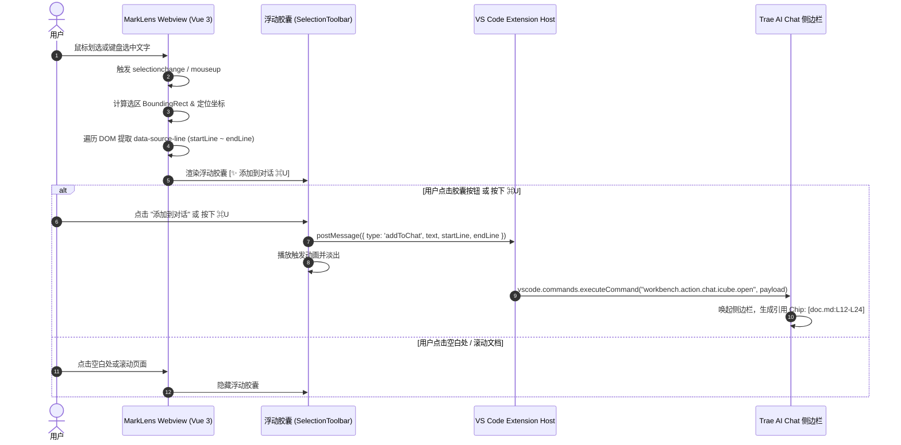

# MarkLens 预览窗口选中文本「添加到对话 (⌘U)」设计与实现方案

## 1. 背景与目标

### 1.1 现状与用户诉求

在 Trae CN 原生代码编辑器中，用户选中文本或代码片段时，光标上方会自动弹出一个精致的浮动胶囊菜单（Floating Toolbar）：

- `✨ 编辑 ⌘I`
- `添加到对话 ⌘U`

点击或按下 `⌘U` 后，选中的代码片段会作为一个带有文件路径、行号范围和代码引用的上下文小卡片（Context Chip）自动插入到 Trae 右侧的 AI Chat 对话框中，极大方便了与 AI 协同讨论。

然而，在 MarkLens 等 VS Code 自定义 Webview 编辑器（或 Markdown 预览窗口）中：

1. **由于 Webview 属于独立的沙盒 iframe，其文字选区属于浏览器 DOM 的 `window.getSelection()`**，而非 Monaco Editor 的 `ITextEditor.getSelection()`。
2. VS Code 与 Trae 原生的编辑器选中监听器无法捕获 Webview 内部的 DOM 选区，因此原生的浮动悬浮条不会自动出现。
3. 用户在预览窗口阅读文档时，看到某段逻辑、架构说明或技术要点想向 AI 提问时，必须手动切回源码或手动复制粘贴，体验割裂。

### 1.2 核心目标

1. **接口可行性验证**：深挖 Trae CN 底层架构，确定是否有官方或内部命令接口可接收选区并投递到 AI 对话。
2. **复刻原生体验**：在 MarkLens 预览窗口中选中文本时，自动在选区上方弹出视觉风格高度一致的浮动小胶囊（`✨ 添加到对话 ⌘U` 等）。
3. **源码行号联动**：利用 MarkLens 渲染管线的 `data-source-line` 属性，精确计算选区对应的 Markdown 源码行号范围，将带行号引用的上下文注入 AI 对话。
4. **多宿主优雅降级**：优先适配 Trae CN，同时对标准 VS Code（GitHub Copilot Chat）和通用环境提供兼容降级。

---

## 2. Trae CN 底层机制与 API 探秘

通过对 Trae CN 桌面核心应用包（`/Applications/Trae CN.app/Contents/Resources/app/out/vs/workbench/workbench.desktop.main.js`）的逆向与源码分析，我们完整揭示了 Trae 的浮动胶囊和「添加到对话」的底层实现。

### 2.1 原生编辑器的实现原理

- 原生编辑器中的浮动工具栏类名为 `icube.inlineChat.hoverWidget`。
- 它监听编辑器的光标选区事件 `onDidChangeCursorSelection`。
- 「添加到对话」按钮绑定的命令 ID 为：
  - **内部标识**：`hws = "icube.inlineChat.addToChat"`
  - **核心命令**：`$p = "workbench.action.chat.icube.open"`

### 2.2 Trae 暴露的核心命令接口

Trae 在 VS Code 命令总线中注册了专属于 AI 对话的核心命令：
👉 **`workbench.action.chat.icube.open`**

在 Trae 的 `P6r` 命令实现中，该命令支持丰富的 Payload 参数，特别是专门为视图/文档设计的 **`docviewPayload`**：

```typescript
// Trae 内部的 docviewPayload 处理逻辑：
if (e?.addToChat && e.docviewPayload) {
  const m = e.docviewPayload.uri
  const b = e.docviewPayload.selection ? [e.docviewPayload.selection] : []
  const v = n.getWorkspace().folders[0]
  const w = v ? (em(v.uri, m) ?? m.fsPath) : m.fsPath

  // 触发 Trae AI 侧边栏的添加上下文事件！
  document.dispatchEvent(
    new CustomEvent("icube.ai-chat.addToChat", {
      detail: {
        args: {
          uri: m,
          selections: b,
          relatePath: w,
          markdownSelection: e.docviewPayload.markdownSelection,
        },
      },
    }),
  )
  return
}
```

### 2.3 命令调用规范（API 规格）

VS Code 扩展宿主可通过标准的 `vscode.commands.executeCommand` 直接调用该接口：

```typescript
import * as vscode from "vscode"

await vscode.commands.executeCommand("workbench.action.chat.icube.open", {
  addToChat: true, // 标记为添加到对话
  keepOpen: true, // 保持对话面板打开并聚焦
  docviewPayload: {
    uri: documentUri, // vscode.Uri 对象（当前 Markdown 文件的 URI）
    selection: {
      startLineNumber: startLine,
      startColumn: 1,
      endLineNumber: endLine,
      endColumn: 1,
    },
    markdownSelection: selectedText, // 选中的文字内容
  },
})
```

**执行效果**：
Trae 的 AI Chat 侧边栏会自动展开（若未展开），并在输入框上方生成一个与原生编辑器完全一致的上下文 Chip：

- 图标：Markdown 文件图标 📄
- 文本：`文件名:L[startLine]-L[endLine]`
- 点击该 Chip 可展开预览引用的文本内容。

---

## 3. 系统整体架构



---

## 4. 详细模块设计与实现

### 4.1 选区定位与源码行号映射算法

MarkLens 的 Markdown 渲染引擎已经在所有块级 HTML 元素（如 `<h1>`~`<h6>`、`<p>`、`<ul>`、`<pre>` 等）上通过 Marked 扩展注入了 `data-source-line` 属性。

#### 行号计算逻辑：

1. 获取 `const sel = window.getSelection()`。若 `sel.isCollapsed` 或 `sel.toString().trim() === ''` 则忽略。
2. 获取 `range = sel.getRangeAt(0)`。
3. 查找起始块元素：从 `range.startContainer` 向上查找具有 `[data-source-line]` 属性的最近祖先元素。
4. 查找结束块元素：从 `range.endContainer` 向上查找具有 `[data-source-line]` 属性的最近祖先元素。
5. 提取行号：
   - `startLine = parseInt(startEl.dataset.sourceLine || '1')`
   - `endLine = parseInt(endEl.dataset.sourceLine || startLine)`
   - 若 `endLine < startLine`，做 `Math.min / Math.max` 纠正。

### 4.2 浮动胶囊（Selection Toolbar）UI 设计

#### 视觉规范：

- 严格遵循 Trae 和 VS Code 的原生质感：
  - 背景：`var(--vscode-editorWidget-background)`，半透明高斯模糊（`backdrop-filter: blur(8px)`）。
  - 边框：`1px solid var(--vscode-editorWidget-border)`。
  - 阴影：`0 4px 12px rgba(0, 0, 0, 0.18)`。
  - 圆角：`6px` 或 `20px` 胶囊圆角。
- 按钮布局：
  - `[ ✨ 添加到对话  ⌘U ]`（主动作）
  - 分割线 `|`
  - `[ ✏️ 编辑源码  ⏎ ]`（联动双击定位编辑功能，单键切换到源码精准定位）
  - 分割线 `|`
  - `[ 📋 复制 ]`

#### 边缘防溢出定位算法：

- 默认位置：出现在选区上方居中偏上 `8px` 处（`top = rect.top - toolbarHeight - 8`）。
- 顶部溢出处理：若 `rect.top < toolbarHeight + 16`，则翻转显示在选区下方（`top = rect.bottom + 8`）。
- 左右防出界：`left = clamp(rect.left + rect.width / 2 - toolbarWidth / 2, 12, window.innerWidth - toolbarWidth - 12)`。

### 4.3 快捷键绑定与事件监听

在 Webview 全局监听 `keydown`：

- 捕获 `(e.metaKey || e.ctrlKey) && (e.key === 'u' || e.key === 'U')`：
  - 如果当前有文本选中，`e.preventDefault()` 并立即触发「添加到对话」。
- 滚动隐藏（Scroll Dismissal）：
  - 监听 Markdown 容器的 `scroll` 事件，页面滚动时自动隐藏胶囊，避免浮在脱节位置。
- 点击空白隐藏（Click Outside）：
  - 监听 `pointerdown`，点击非 Toolbar 区域且未产生新选中时淡出。

### 4.4 消息通道与宿主扩展处理

#### Webview -> Host 消息定义：

```typescript
export interface AddToChatMessage {
  type: "addToChat"
  text: string
  startLine: number
  endLine: number
}
```

#### Extension 宿主处理实现：

```typescript
// 在 src/extension/extension.ts 中的 onDidReceiveMessage:
case 'addToChat': {
  const currentUri = document.uri;
  const { text, startLine, endLine } = message;

  await sendSelectionToAIChat(currentUri, text, startLine, endLine);
  break;
}
```

---

## 5. 多宿主环境兼容与降级策略

MarkLens 是面向全生态 VS Code 插件市场的扩展，不仅运行在 Trae CN 上，也运行在标准 VS Code、VS Code Insiders、Cursor 等环境中。我们需要建立清晰的**兼容性矩阵**：

| 宿主环境                          | 检测方式                                         | 调度行为                                                                                    |
| --------------------------------- | ------------------------------------------------ | ------------------------------------------------------------------------------------------- |
| **Trae CN / Trae**                | 能查询到 `workbench.action.chat.icube.open` 命令 | 执行 `workbench.action.chat.icube.open`，带 `docviewPayload`（最佳体验，生成文件行号 Chip） |
| **标准 VS Code + GitHub Copilot** | 查询到 `workbench.action.chat.open`              | 执行 `workbench.action.chat.open`，将选中文本与 `#file:path:Lstart-Lend` 作为 query 注入    |
| **Cursor**                        | 查询到 `cursor.chat` 相关命令                    | 调用 Cursor 聊天唤起命令                                                                    |
| **无 AI 侧边栏环境**              | 上述命令均不可用                                 | 自动将选中文本与引用复制到剪贴板，并弹出右下角提示：「已复制选中文本与行号引用」            |

### 降级执行器代码示例：

```typescript
async function sendSelectionToAIChat(
  uri: vscode.Uri,
  text: string,
  startLine: number,
  endLine: number,
) {
  const allCommands = await vscode.commands.getCommands(true)

  // 1. 优先 Trae 原生 AI Chat
  if (allCommands.includes("workbench.action.chat.icube.open")) {
    try {
      await vscode.commands.executeCommand("workbench.action.chat.icube.open", {
        addToChat: true,
        keepOpen: true,
        docviewPayload: {
          uri,
          selection: {
            startLineNumber: startLine,
            startColumn: 1,
            endLineNumber: endLine,
            endColumn: 1,
          },
          markdownSelection: text,
        },
      })
      return
    } catch (err) {
      console.warn("Failed to call Trae chat command, falling back...", err)
    }
  }

  // 2. 尝试标准 VS Code Copilot Chat
  if (allCommands.includes("workbench.action.chat.open")) {
    const relativePath = vscode.workspace.asRelativePath(uri)
    const query = `关于 \`${relativePath}\` 第 ${startLine}-${endLine} 行的内容：\n> ${text}\n\n`
    await vscode.commands.executeCommand("workbench.action.chat.open", {
      query,
    })
    return
  }

  // 3. 兜底方案：复制到剪贴板并提示
  await vscode.env.clipboard.writeText(text)
  vscode.window.showInformationMessage(
    `已复制第 ${startLine}-${endLine} 行内容到剪贴板`,
  )
}
```

---

## 6. 配置项与用户偏好

在 `package.json` 的 `configuration` 中增加配置选项：

```json
{
  "marklens.preview.floatingSelectionToolbar.enabled": {
    "type": "boolean",
    "default": true,
    "description": "选中文本时是否显示浮动操作工具条（添加到对话、定位源码、复制）"
  },
  "marklens.preview.floatingSelectionToolbar.showEditSource": {
    "type": "boolean",
    "default": true,
    "description": "浮动工具条中是否显示「编辑源码」快捷按钮"
  }
}
```

---

## 7. 实施计划与里程碑

1. **Phase 1：选区与行号计算原型（Webview 基础能力）**
   - 编写 `useSelectionToolbar.ts`，实现选区坐标监听与防抖。
   - 实现通过 `data-source-line` 反查选区行号范围的核心算法。
   - 编写单元测试验证行号解析准确性。

2. **Phase 2：UI 组件与交互（SelectionToolbar.vue）**
   - 封装浮动胶囊组件，实现 Trae 风格的高斯模糊磨砂质感与进出场过渡。
   - 实现顶部/边缘防遮挡与滚动防抖隐藏。
   - 接入 `⌘U` / `Ctrl+U` 快捷键捕获。

3. **Phase 3：宿主端命令对接与环境适配**
   - 在 `src/extension/extension.ts` 实现 `sendSelectionToAIChat` 分发器。
   - 对接 Trae 的 `workbench.action.chat.icube.open` 命令。
   - 添加 Copilot / 剪贴板降级机制。

4. **Phase 4：打包验证与端到端实测**
   - 在 Trae CN 真实窗口中测试划选长段落、列表、代码块并按 `⌘U`。
   - 检查 AI 侧边栏是否正常生成 context chip 并且内容可折叠展开。
